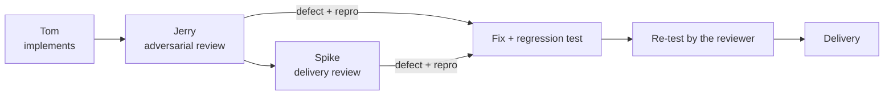
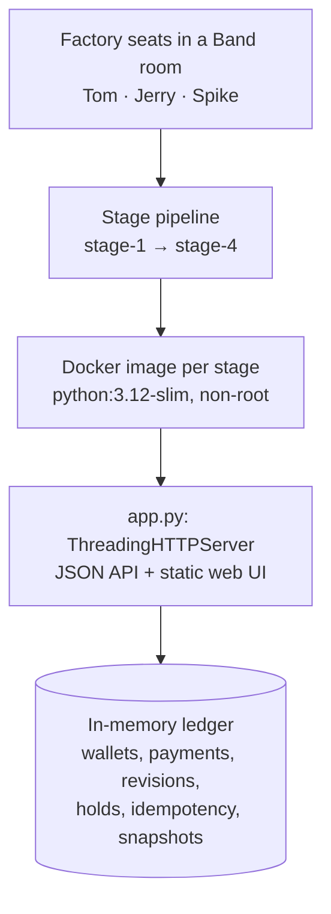

# Pocketful

**A Venmo-style wallet and payments service, built stage by stage by a three-agent software factory.**

Pocketful started as a payments API and grew into a ledger with a browser UI, holds, point-in-time
balances, statements, corrections, refunds and batch corrections. The work was implemented by
Tom, reviewed by Jerry, and independently audited by Spike, with defects reproduced, fixed and
re-verified before delivery.

🎥 **Demo video:** [LINK TO BE ADDED] &nbsp;·&nbsp; 📦 **Repository:** [github.com/KRYSTALM7/pocketful-factory](https://github.com/KRYSTALM7/pocketful-factory) &nbsp;·&nbsp; 🏭 **Factory write-up:** [`FACTORY.md`](FACTORY.md)

Submission for the WeAreDevelopers **Dark Factory** hackathon, track **Pocketful**.

<!-- HERO IMAGE PLACEHOLDER
Replace this comment with the final Pocketful dashboard screenshot.
Recommended: wide 16:9 screenshot showing the main wallet dashboard.
-->

| | |
|---|---|
| **What it is** | A self-contained Python 3.12 HTTP service (standard library only, in-memory state) with a bundled web UI |
| **Why it's interesting** | Money must stay correct under concurrency, retries, corrections made after the fact, and imports from older versions |
| **What the factory did** | Tom implemented each stage; Jerry reviewed and Spike independently audited, reproducing defects and re-verifying the fixes |
| **Where to look** | [Demo](#-demo) · [The factory](#-the-factory) · [Defects the factory caught](#-defects-the-factory-caught) · [Validation](#-validation) |

---

## 💸 What is Pocketful?

Pocketful is a wallet where people hold a balance and move money to each other by **handle**.

- **Send and request money.** Pay someone directly, or ask for money and let them pay, decline or cancel the request. Payments carry a **note** and a **public or private** visibility that controls who sees them in the activity feed.
- **Split bills.** Divide an amount across several people, with the remainder distributed deterministically.
- **Holds.** Reserve money with an authorization, then capture it in parts, void it, or let it expire. Held money reduces what you can spend without leaving your wallet.
- **Settlements.** An operator can move money between several wallets in one all-or-nothing settlement.
- **Safe retries.** Every money-moving write takes an `Idempotency-Key`. A retry returns the original result instead of paying twice.
- **History.** Ask for your balance **as of** any instant, page through **statements** with opening and closing balances, and get **stable snapshot** tokens so pages don't shift while you read.
- **Corrections.** A sender can correct a payment's amount and **effective time** without rewriting history. Every payment keeps an immutable revision trail, and you can ask what the ledger looked like **as known** at an earlier moment.
- **Refunds.** A recipient can refund a payment, in whole or in parts.
- **Batch corrections.** An operator can correct several payments atomically, including whole settlements.

## 🧠 Why this is hard

This is not a CRUD wallet. Every stage added rules that had to stay true together:

| Concern | What must hold |
|---|---|
| **Money conservation** | The sum of all wallets never changes, in every current *and* historical view |
| **Concurrency** | 50 requests in flight; concurrent writes on the same revision cannot both succeed |
| **Idempotent retries** | Same key and same body give the original response; same key with a different body is rejected |
| **Atomicity** | A rejected settlement, correction or batch changes nothing: no balances, history or idempotency records |
| **Two clocks** | *Effective* time (when money moved) is separate from *recorded* time (when the ledger learned of it); queries can select either |
| **Corrections** | Revisions are append-only; a correction may not make any past balance negative (`historical_overdraft`) |
| **Holds over time** | Total, held and available balances must agree at every past instant, through capture, void and expiry |
| **Refunds and corrections** | Refunds are capped by the *corrected* amount; a correction can't drop below what was already refunded |
| **Settlements** | Membership is permanent; a settlement member is corrected only together with all other members, at one effective instant |
| **Stable snapshots** | A statement token keeps paging its frozen result after later payments, corrections and imports |
| **Upgrades** | Each stage imports unchanged exports from every earlier stage's service |
| **Offline** | Every stage builds and serves from a container with `--network none` |

## 🏭 The factory

Pocketful was produced by three independent agent seats working in one shared **Band** room.
Earlier development activity also ran on Codex. The final seat configuration is Claude Code
with `claude-opus-5-5` for every seat, as recorded in the first two lines of each mandate.
See [`FACTORY.md`](FACTORY.md#model--provider-usage) for provider usage.

| Seat | Role | Mandate |
|---|---|---|
| **Tom** | Implementation: reads the spec, carries the previous stage forward, implements, writes and runs tests, fixes findings | [`mandates/tom.md`](mandates/tom.md) |
| **Jerry** | Adversarial verification and review: edge cases, failure paths, validation order, concurrency; reproduces defects and re-tests fixes | [`mandates/jerry.md`](mandates/jerry.md) |
| **Spike** | Independent verification and delivery review: clean builds, offline containers, cross-stage compatibility, harness and packaging gates | [`mandates/spike.md`](mandates/spike.md) |



The seat that writes code is never the only seat that judges it. Reviewers inspect the
repository and rerun checks themselves rather than trusting the implementer's report, and a
finding is only raised with a concrete reproduction: a request sequence, a failing test or a
container command. The owner dispatched stage tasks and follow-up instructions in the room,
and the room log is included as [`room.json`](room.json). We don't claim the run was free of
human steering.

> The room export lists a fourth agent seat as "Unknown". It is the first Spike session,
> replaced partway through by the current Spike seat; see [`mandates/unknown.md`](mandates/unknown.md).

## 🧱 Four-stage evolution

Each stage folder starts as a copy of the previous one and is extended in place. Every folder
is a complete, standalone service that still satisfies all earlier stages and imports their
exports.

| Stage | Folder | Adds |
|---|---|---|
| **1** | [`stage-1/`](stage-1/) | Core HTTP API: signup/login, handles, payments, requests, bill splits, activity feed with visibility, atomic settlements, idempotent writes, export/import |
| **2** | [`stage-2/`](stage-2/) | Browser UI served by the service, and wallet **authorizations** (holds) with partial captures, voids and expiry |
| **3** | [`stage-3/`](stage-3/) | Timestamped payment history, `/me?as_of=&known_at=`, paginated **statements** with snapshot tokens, payment **corrections** with revision history, settlement history and historical holds |
| **4** | [`stage-4/`](stage-4/) | **Refunds** and operator **correction batches**, including whole-settlement corrections |

```text
stage-1/ ──copy+extend──► stage-2/ ──copy+extend──► stage-3/ ──copy+extend──► stage-4/
```

## 🐞 Defects the factory caught

Two examples of the review → reproduce → fix → re-test cycle. Neither showed up in the
shipped harness checks or the happy-path suites; both came from deliberate volume and
concurrency probing during verification. Full details are in [`FACTORY.md`](FACTORY.md#bad-work-caught-and-recovery).

### 1. Connection backlog under a 50-request burst

- **Found:** Jerry's adversarial audit released 50 `POST /payments` at once behind a barrier
  against the committed Stage 4 image. Inside the Linux container, every round lost 2–4
  requests to `ConnectionResetError`. Through the host port mapping, each round lost one to
  `RemoteDisconnected`. The dropped requests committed nothing. On Windows, a stage service
  run directly showed the related behaviour: connections refused under the burst.
- **Cause:** Python's `ThreadingHTTPServer` defaults to a listen backlog of 5; the spec requires
  up to 50 concurrent requests.
- **Control:** the same `app.py` with `request_queue_size = 128` gave 50/50 successes in every round.
- **Fix:** every stage now uses a server subclass with `request_queue_size = 128`.
- **Re-test:** `test_fifty_simultaneous_requests_all_complete` fires repeated barrier-synchronized
  bursts of 50, because a short backlog only drops part of a burst some of the time. It passes
  in all four stages.

### 2. Exports larger than the 2 MB body limit

- **Found:** Spike's final delivery audit. About 3,000 payments produced a 4.3 MB export, and
  posting it unchanged to `/_test/import` returned `400 malformed_request`, although the spec
  requires import to accept any unchanged export.
- **Cause:** a 2,000,000-byte request-body cap applied to every route, in all four stages.
- **Fix:** ordinary routes keep the 2 MB cap; `/_test/import` has a separate 512 MiB limit.
  Applied in all four stage folders.
- **Re-test:** `test_export_larger_than_the_body_cap_imports_unchanged` builds an export over
  2 MB and checks that it imports unchanged with balances intact.

## ✅ Validation

Two kinds of result are reported here. Keep them apart: neither is the final judging result,
and the judges' suite is larger than anything shipped with the track.

**Development validation:** each stage's own pytest suite, run over HTTP against the service.

| Stage | Own test suite |
|---|---|
| Stage 1 | 180 passed |
| Stage 2 | 53 passed |
| Stage 3 | 84 passed |
| Stage 4 | 103 passed |

**Event harness, shipped track-level checks:** `python -m harness run --all`, host mode,
fresh clone at the Stage 4 commit. The Stage 4 folder passed suites 1–4:

| Suite | Result |
|---|---|
| Stage 1 | 147/147 |
| Stage 2 | 35/35 |
| Stage 3 | 6/6 |
| Stage 4 | 5/5 |

Every folder claimed its own stage, each lower folder failed the next stage's suite as
expected, and the upgrade checks 1→2, 2→3 and 3→4 passed.

**Also verified during development:**

- **Docker / offline:** the Stage 4 image was built from a fresh clone and run with
  `--network none --cpus 2 --memory 2g`. `/health`, the UI and its assets were served, as a
  non-root user.
- **Concurrency:** 50 simultaneous requests all complete; parallel retries with the same key
  return one 201 and identical 200s; concurrent corrections on one revision commit once.
- **Large export/import:** an export over 2 MB imports unchanged.

## 🏗️ Architecture



- **One file per service.** Each stage's `app.py` is the whole service: HTTP routing, validation
  and the ledger. Stages 2+ also serve the bundled `web/` assets.
- **Standard library only.** The runtime image installs nothing beyond Python 3.12.
- **In-memory state.** Nothing survives a container restart, and the spec does not require it to.
  `/_test/reset`, `/_test/export` and `/_test/import` seed, export and restore it.
- **Serialized writes.** One process-wide lock makes every operation atomic and keeps
  concurrent corrections from both committing.

## 📁 Repository structure

```text
pocketful-factory/
├── stage-1/          Core API
├── stage-2/          + web UI and holds
├── stage-3/          + history, statements, corrections
├── stage-4/          + refunds and correction batches
│   ├── app.py        the complete service
│   ├── Dockerfile    runtime image (python:3.12-slim, non-root)
│   ├── RUN.md        per-stage build/run/test notes
│   ├── pytest.ini
│   ├── web/          UI assets (stage 2 onward)
│   └── tests/        pytest suite, run over HTTP
├── mandates/         generic mandate per seat (first two lines: harness and model)
├── seats/            short seat descriptions
├── FACTORY.md        how the factory works, quality gates, defects, measured activity
├── README.md         this file
└── room.json         full Band room session export
```

## ▶️ Run locally

The service itself needs **only Python 3.12+**; there are no runtime dependencies. Each stage
listens on `0.0.0.0:$PORT`, and `PORT` defaults to `8080`. Replace `stage-4` with `stage-1`,
`stage-2` or `stage-3` to run another stage.

**Linux / macOS**

```sh
cd stage-4
PORT=8080 python app.py
```

**Windows (PowerShell)**

```powershell
cd stage-4
$env:PORT = "8080"; python app.py
```

Then `http://localhost:8080/health` returns `{"status":"ok"}`. From Stage 2 onward, open
`http://localhost:8080/` in a browser. The service starts empty; seed users with
`POST /_test/reset`.

## 🧪 Run the tests

The suites are HTTP tests. By default each suite starts its own server process from the
stage's `app.py` on a free port.

**Test dependencies** are listed per stage in `stage-N/requirements-dev.txt` (test-only, not
part of the runtime image; there is no root-level requirements file). From inside a stage folder:

```sh
python -m pip install -r requirements-dev.txt
python -m playwright install chromium   # stages 2–4 only (browser tests)
```

**Run a stage's suite** (identical for every stage):

```sh
cd stage-1    # or stage-2, stage-3, stage-4
python -m pytest -q tests
```

**Against a server that's already running**, for example a Docker container, set
`POCKETFUL_BASE_URL`:

```sh
POCKETFUL_BASE_URL=http://127.0.0.1:8080 python -m pytest -q tests
```

```powershell
$env:POCKETFUL_BASE_URL = "http://127.0.0.1:8080"; python -m pytest -q tests
```

Because later stages must still satisfy earlier ones, you can also run an earlier stage's
suite against a later stage's server (e.g. the `stage-1` suite against a running `stage-4`).

## 🐳 Docker and offline validation

Build and run any stage (shown for Stage 4):

```sh
cd stage-4
docker build -t pocketful-stage-4 .
docker run --rm -e PORT=8080 -p 8080:8080 pocketful-stage-4
```

Offline check, matching the conditions used during development. A `--network none` container
publishes no host ports, so query it from inside:

```sh
docker run --rm -d --network none --cpus 2 --memory 2g -e PORT=8080 --name pf-offline pocketful-stage-4
docker exec pf-offline python -c "import urllib.request as u; print(u.urlopen('http://127.0.0.1:8080/health').read())"
docker stop pf-offline
```

Expected output: `b'{"status":"ok"}'`.

## 🧾 Harness validation

With the hackathon kickoff package (`dark-factory-wearedevs/`) checked out and its harness
dependencies installed, run from that directory:

```sh
python -m harness check --track pocketful <path-to-this-repo>
python -m harness run --track pocketful --repo <path-to-this-repo> --all
```

On **Windows**, enable Python's UTF-8 mode first. `room.json` is UTF-8, and the Windows locale
can otherwise cause a decoding error:

```powershell
$env:PYTHONUTF8 = "1"
python -m harness check --track pocketful C:\path\to\pocketful-factory
```

**Known Windows limitation (harness, not project):** the isolated stage runner
(`--mode isolated`, used for Gate 3) passes a Windows-style test path into its Linux container
and fails to collect tests on a Windows host. The harness did **not** complete Gate 3 in
isolated mode on Windows. The same requirement (Stage 1 builds and serves `/health`) was
verified manually with Docker as above, and the suites were run in host mode.

## 📦 Submission artifacts

| Artifact | What it is |
|---|---|
| `stage-1/` … `stage-4/` | Four buildable services, each with `Dockerfile`, `RUN.md`, `app.py` and tests |
| [`FACTORY.md`](FACTORY.md) | The factory: seats, collaboration model, quality gates, defects caught, measured activity, reproducibility |
| [`mandates/`](mandates/) | Generic standing instructions per seat, with harness and model: `tom.md`, `jerry.md`, `spike.md`, and `unknown.md` for the first Spike session |
| [`room.json`](room.json) | The full Band room session export, downloaded unchanged; it is not regenerated or edited |
| `README.md` | This guide |

## 📘 Factory documentation

[`FACTORY.md`](FACTORY.md) covers the details: how to set up the seats, why mandates stay
generic, the stage pipeline, the collaboration and handoff model, quality gates and their
results, the defects caught with their recovery, measured factory activity, and step-by-step
reproducibility.

## 🎬 Demo

🎥 **Demo video:** [LINK TO BE ADDED]

<!-- SCREENSHOT 1 PLACEHOLDER: Main dashboard
Replace with a screenshot of the wallet dashboard (balance, available/held, recent activity).
-->

<!-- SCREENSHOT 2 PLACEHOLDER: Send / request flow
Replace with a screenshot of sending a payment or requesting money.
-->

<!-- SCREENSHOT 3 PLACEHOLDER: Requests, splits and holds
Replace with a screenshot of the requests, split or authorizations screens.
-->

<!-- SCREENSHOT 4 PLACEHOLDER: Historical / advanced functionality
Replace with a screenshot showing statements, corrections or refunds.
-->

<!-- SCREENSHOT 5 PLACEHOLDER (optional): Factory evidence
Replace with a screenshot of the Band room showing the seats and their handoffs.
-->

## ⚠️ Known limitations

- State is in memory and is lost when the container restarts (not required by the spec).
- All requests go through one process-wide lock. This is simple and safe, but latency grows
  with history. One development measurement in the container: 100 corrections at 50 in flight
  with approximately 3.2k payments peaked at about 3.3 s, against a 5 s request limit. This
  describes that workload only, not general request latency.
- Shipped harness checks are only part of the judging suite. Passing them does not prove full
  compliance.

## 🌟 What makes Pocketful different

Pocketful isn't just a wallet demo. It's a financial service hardened over four stages, where
every stage had to keep money conserved, retries safe and history consistent while new rules
piled on. It was produced by an agent factory in which implementation, adversarial review,
defect reproduction, correction and re-verification were built into the process. Two real
defects that every shipped check missed were caught, reproduced and fixed with regression tests
before delivery.
