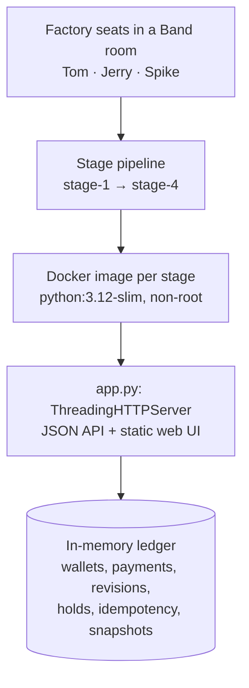
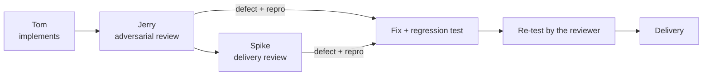

# Pocketful Factory

**A Venmo-style wallet and payments service, built stage by stage by a three-seat agent software factory.**

Submission for the WeAreDevelopers **Dark Factory** hackathon, track **Pocketful**.

**Demo video:** [YouTube](https://www.youtube.com/watch?v=ofozYzJeyH0) · **Repository:** [github.com/KRYSTALM7/pocketful-factory](https://github.com/KRYSTALM7/pocketful-factory) · **Factory write-up:** [`FACTORY.md`](FACTORY.md)

<!-- IMAGE PLACEHOLDER: Pocketful landing page screenshot -->

## What it is

Pocketful Factory is two things in one repository:

1. **The factory.** Three agent seats (Tom, Jerry and Spike) work in one shared Band room.
   Tom implements, Jerry runs adversarial reviews, and Spike reviews delivery independently.
   Their standing instructions are in [`mandates/`](mandates/), and the full room log is in
   [`room.json`](room.json).
2. **What it produced.** Four buildable stages of Pocketful, in `stage-1/` to `stage-4/`.
   Each one is a self-contained Python 3.12 HTTP service (standard library only, in-memory
   state). From Stage 2 onward it also serves a bundled web UI.

**Where a judge should look first:** [Validation Results](#validation-results), then
[Agent Team](#agent-team), [`FACTORY.md`](FACTORY.md#bad-work-caught-and-recovery) for the
defects the factory caught, and `stage-4/` for the most complete service.

## The Application

Pocketful is a wallet where people hold a balance and move money to each other by **handle**.

- **Send and request money.** Pay someone directly, or request money and let them pay, decline or cancel the request. Payments carry a note and a public or private visibility.
- **Split bills.** Divide an amount across several people, with the remainder distributed deterministically.
- **Holds.** Reserve money with an authorization, then capture it in parts, void it, or let it expire.
- **Settlements.** An operator moves money between several wallets in one all-or-nothing settlement.
- **Safe retries.** Every money-moving write takes an `Idempotency-Key`, so a retry never pays twice.
- **History.** Balances **as of** any instant, paginated **statements**, and stable snapshot tokens.
- **Corrections and refunds.** Append-only payment revisions, refunds in whole or in parts, and atomic operator correction batches.

<!-- IMAGE PLACEHOLDER: Pocketful wallet screenshot -->

<!-- IMAGE PLACEHOLDER: Pocketful split-payment screenshot -->

These rules have to hold together at every stage:

| Concern | What must hold |
|---|---|
| **Money conservation** | The sum of all wallets never changes, in every current *and* historical view |
| **Concurrency** | 50 requests in flight; concurrent writes on the same revision cannot both succeed |
| **Idempotent retries** | Same key and body return the original response; same key with a different body is rejected |
| **Atomicity** | A rejected settlement, correction or batch changes nothing |
| **Two clocks** | *Effective* time (when money moved) is separate from *recorded* time (when the ledger learned of it) |
| **Upgrades** | Each stage imports unchanged exports from every earlier stage |
| **Offline** | Every stage builds and serves from a container with `--network none` |

## Factory Architecture



- **One file per service.** Each stage's `app.py` is the whole service: routing, validation and
  the ledger. Stages 2+ also serve the bundled `web/` assets.
- **Standard library only.** The runtime image installs nothing beyond Python 3.12.
- **Serialized writes.** One process-wide lock makes every operation atomic.

<!-- IMAGE PLACEHOLDER: BAND factory/agent collaboration screenshot -->

## Agent Team

| Seat | Role | Mandate |
|---|---|---|
| **Tom** | Implementation: reads the spec, carries the previous stage forward, implements, writes and runs tests, fixes findings | [`mandates/tom.md`](mandates/tom.md) |
| **Jerry** | Adversarial verification: edge cases, failure paths, validation order, concurrency; reproduces defects and re-tests fixes | [`mandates/jerry.md`](mandates/jerry.md) |
| **Spike** | Independent delivery review: clean builds, offline containers, cross-stage compatibility, harness and packaging gates | [`mandates/spike.md`](mandates/spike.md) |



The seat that writes code is never the only seat that judges it. Reviewers rerun checks
themselves instead of trusting the implementer's report, and a finding is raised only with a
concrete reproduction. Earlier development also ran on Codex. In the final configuration every
seat is Claude Code with `claude-opus-5-5`, as recorded in the first two lines of each mandate.
The owner dispatched stage tasks and follow-up instructions in the room, so we don't claim the
run was free of human steering. The room export lists a fourth seat as "Unknown": it is the
first Spike session (see [`mandates/unknown.md`](mandates/unknown.md)).

Two examples of defects caught by review, both missed by the shipped harness checks (details in
[`FACTORY.md`](FACTORY.md#bad-work-caught-and-recovery)):

- **Connection backlog under a 50-request burst.** The default listen backlog of 5 dropped requests under load. Every stage now uses `request_queue_size = 128`, covered by `test_fifty_simultaneous_requests_all_complete`.
- **Exports over the 2 MB body limit.** A 4.3 MB unchanged export was rejected on import. `/_test/import` now has a separate 512 MiB limit, covered by `test_export_larger_than_the_body_cap_imports_unchanged`.

## Stage Pipeline

Each stage folder starts as a copy of the previous one and is extended in place. Every folder
is a complete, standalone service that still satisfies all earlier stages and imports their
exports.

### Stage 1 — Core wallet

Folder: [`stage-1/`](stage-1/)

- Core HTTP API: signup/login and handles
- Payments, requests and bill splits
- Activity feed with visibility
- Atomic settlements and idempotent writes
- Export/import

### Stage 2 — Wallet experience

Folder: [`stage-2/`](stage-2/)

- Browser UI served by the service
- Wallet **authorizations** (holds) with partial captures, voids and expiry

### Stage 3 — Financial history

Folder: [`stage-3/`](stage-3/)

- Timestamped payment history and `/me?as_of=&known_at=`
- Paginated **statements** with snapshot tokens
- Payment **corrections** with revision history
- Settlement history and historical holds

### Stage 4 — Corrections and refunds

Folder: [`stage-4/`](stage-4/)

- **Refunds**
- Operator **correction batches**, including whole-settlement corrections

```text
stage-1/ → stage-2/ → stage-3/ → stage-4/
```

## Repository Structure

```text
pocketful-factory/
├── stage-1/          Core API
├── stage-2/          + web UI and holds
├── stage-3/          + history, statements, corrections
├── stage-4/          + refunds and correction batches
│   ├── app.py        the complete service
│   ├── Dockerfile    runtime image (python:3.12-slim, non-root)
│   ├── RUN.md        per-stage build/run/test notes
│   ├── pytest.ini
│   ├── web/          UI assets (stage 2 onward)
│   └── tests/        pytest suite, run over HTTP
├── mandates/         generic mandate per seat (first two lines: harness and model)
├── seats/            short seat descriptions
├── FACTORY.md        how the factory works, quality gates, defects, measured activity
├── README.md         this file
└── room.json         full Band room session export
```

## Quick Start

The service needs **only Python 3.12+**, with no runtime dependencies:

```sh
cd stage-4
PORT=8080 python app.py
```

Open `http://localhost:8080/`. `http://localhost:8080/health` returns `{"status":"ok"}`. The
service starts empty; seed users with `POST /_test/reset`.

## Run a Stage

Each stage listens on `0.0.0.0:$PORT`, and `PORT` defaults to `8080`. Replace `stage-4` with
`stage-1`, `stage-2` or `stage-3` to run another stage.

**Linux / macOS**

```sh
cd stage-4
PORT=8080 python app.py
```

**Windows (PowerShell)**

```powershell
cd stage-4
$env:PORT = "8080"; python app.py
```

## Run Tests

The suites are HTTP tests. By default each suite starts its own server from the stage's
`app.py` on a free port. Test dependencies are listed per stage in
`stage-N/requirements-dev.txt` (test-only; not part of the runtime image).

```sh
cd stage-1    # or stage-2, stage-3, stage-4
python -m pip install -r requirements-dev.txt
python -m playwright install chromium   # stages 2–4 only (browser tests)
python -m pytest -q tests
```

To test a server that's already running, such as a Docker container, set `POCKETFUL_BASE_URL`:

```sh
POCKETFUL_BASE_URL=http://127.0.0.1:8080 python -m pytest -q tests
```

```powershell
$env:POCKETFUL_BASE_URL = "http://127.0.0.1:8080"; python -m pytest -q tests
```

**Event harness.** With the kickoff package (`dark-factory-wearedevs/`) checked out and its
harness dependencies installed, run from that directory:

```sh
python -m harness check --track pocketful <path-to-this-repo>
python -m harness run --track pocketful --repo <path-to-this-repo> --all
```

On Windows, set `$env:PYTHONUTF8 = "1"` first, because `room.json` is UTF-8.

## Docker / Offline Validation

```sh
cd stage-4
docker build -t pocketful-stage-4 .
docker run --rm -e PORT=8080 -p 8080:8080 pocketful-stage-4
```

Offline check, matching the development conditions. A `--network none` container publishes no
host ports, so query it from inside:

```sh
docker run --rm -d --network none --cpus 2 --memory 2g -e PORT=8080 --name pf-offline pocketful-stage-4
docker exec pf-offline python -c "import urllib.request as u; print(u.urlopen('http://127.0.0.1:8080/health').read())"
docker stop pf-offline
```

Expected output: `b'{"status":"ok"}'`. During development the Stage 4 image was built from a
fresh clone and run this way; `/health`, the UI and its assets were served, as a non-root user.

## Validation Results

These are development results, not the final judging result. The judges' suite is larger
than anything shipped with the track.

**All figures below were measured at commit `6c44c8e`,** the last implementation commit. The
later commits `1b1003f` and the final landing/README commit change only UI styling, landing
markup and documentation. They did not produce these numbers.

**Own test suites**, each run on its own at `6c44c8e`:

| Stage | Own test suite |
|---|---|
| Stage 1 | 206 passed |
| Stage 2 | 94 passed |
| Stage 3 | 125 passed |
| Stage 4 | 144 passed |

**Official harness stage results** (`python -m harness run --track pocketful --stage 4`, host
mode, at `6c44c8e`). The Stage 4 folder passed suites 1–4:

| Suite | Result |
|---|---|
| Stage 1 | 147/147 |
| Stage 2 | 35/35 |
| Stage 3 | 6/6 |
| Stage 4 | 5/5 |

`python -m harness check --track pocketful` at `6c44c8e` exited 0: gates 1, 2 and the mandate
part of gate 4 pass. An earlier `harness run --all` on a fresh clone of the original Stage 4
commit showed every folder claiming its own stage, each lower folder failing the next stage's
suite as expected, and the upgrade checks 1→2, 2→3 and 3→4 passing.

**Known Windows limitation (harness, not project):** the isolated stage runner
(`--mode isolated`, used for Gate 3) fails to collect tests on a Windows host. Gate 3 (Stage 1
builds and serves `/health`) was verified manually with Docker instead.

## Security & Reliability

Final hardening commits after the original submission. Each one added regression tests to the
stage suites:

| Commit | Change |
|---|---|
| `c2367eb` | HTTP hardening: every method gets a documented JSON answer, HEAD mirrors GET; security headers (`X-Content-Type-Options`, `Referrer-Policy`) and a strict CSP on the UI |
| `791dc89` | UI hardening: the nav focus ring stays visible on small screens; hold expiry is labelled |
| `d0b25c2` | Fixture reset: Stage 1 hashes fixture passwords concurrently on reset |
| `8c35644` | Concurrency/auth: login and signup password hashing runs outside the service lock |
| `35153b1` | UI hardening: a readable message when the service can't be reached |
| `cdf9124` | HTTP hardening: malformed `Content-Length` and very deeply nested JSON return `400 malformed_request` instead of 500 |
| `947609e` | UI hardening: list error, loading and empty states never overlap; login follows `?next=` only for the app's own routes |
| `6c44c8e` | Deep-JSON protection: request bodies nested deeper than 64 levels return `400 malformed_request` |

Also verified during development: 50 simultaneous requests all complete; parallel retries with
the same key return one 201 and identical 200s; concurrent corrections on one revision commit
once; an export over 2 MB imports unchanged.

## Known Limitations

- State is in memory and is lost when the container restarts (the spec doesn't require persistence).
- All requests go through one process-wide lock. This is simple and safe, but latency grows
  with history. In one development measurement in the container, 100 corrections at 50 in
  flight with about 3.2k payments peaked at about 3.3 s, against a 5 s request limit. That
  describes that workload only.
- The shipped harness checks are only part of the judging suite. Passing them does not prove
  full compliance.
- The landing page and README contain image placeholders for screenshots to be added.

## Submission Artifacts

The repository contains the factory, the stage outputs it generated, the validation evidence,
and the room artifact.

| Artifact | Purpose |
|---|---|
| [`stage-1/`](stage-1/) | Stage 1 service: core wallet API, with `Dockerfile`, `RUN.md`, `app.py` and tests |
| [`stage-2/`](stage-2/) | Stage 2 service: Stage 1 plus the web UI and holds |
| [`stage-3/`](stage-3/) | Stage 3 service: Stage 2 plus history, statements and corrections |
| [`stage-4/`](stage-4/) | Stage 4 service: Stage 3 plus refunds and correction batches |
| [`mandates/`](mandates/) | Generic standing instructions per seat, with harness and model: `tom.md`, `jerry.md`, `spike.md`, and `unknown.md` for the first Spike session |
| [`FACTORY.md`](FACTORY.md) | The factory: seats, collaboration model, quality gates, defects caught, measured activity, reproducibility |
| `README.md` | This overview |
| [`room.json`](room.json) | The full Band room session export, downloaded unchanged; it is not regenerated or edited |
